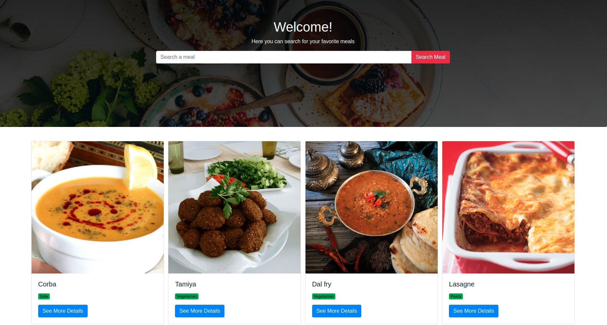

# Building a meals App with React & the Context API

## Technologies

- React
- React-DOM
- Create-React-App
- React Hooks
- React Router
- Eslint
- npm
- CSS
- React Context API

## Live Version

<a href="https://appointcar.netlify.app/" target="_blank" > Live version </a>

## Usage

### Clone the project:

- git clone https://github.com/MouhaDiouf/meals

### Run the project

- to install the dependencies run the command : npm install
- after installation, run the command: npm start

## Description

This is a meals app where users can look for meals, and save them to the database.

## Developed by

Mouhamadou Diouf ( <a href="https://github.com/MouhaDiouf"> @mouhad </a>)

Let's connect on:

- <a href="https://www.linkedin.com/in/mouha-diouf/" target="_blank" > LinkedIn </a>
- <a href="https://twitter.com/mouhamadiouf" target="_blank"> Twitter</a>

You can also check <a href="https://mouhadiouf.com/" target="_blank"> my portfolio </a>

## Potential Future Improvements

- Create an admin dashboard to manage users

## Contributing

1. Fork it (https://github.com/MouhaDiouf/meals)
2. Create your feature branch (git checkout -b feature/[choose-a-name])
3. Commit your changes (git commit -am 'What this commit will fix/add')
4. Push to the branch (git push origin feature/[chosen name])
5. Create a new Pull Request
